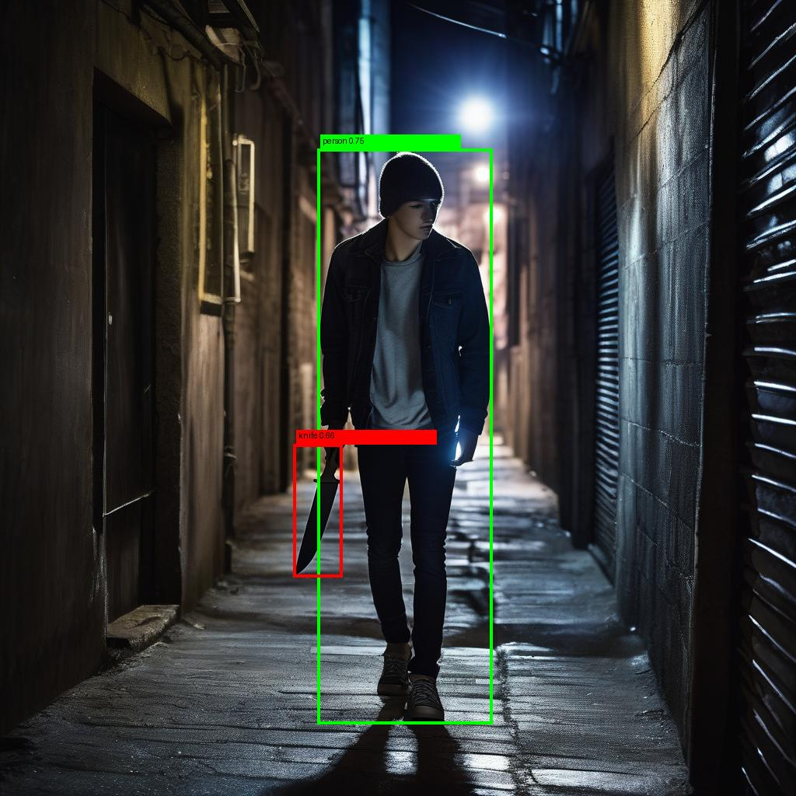
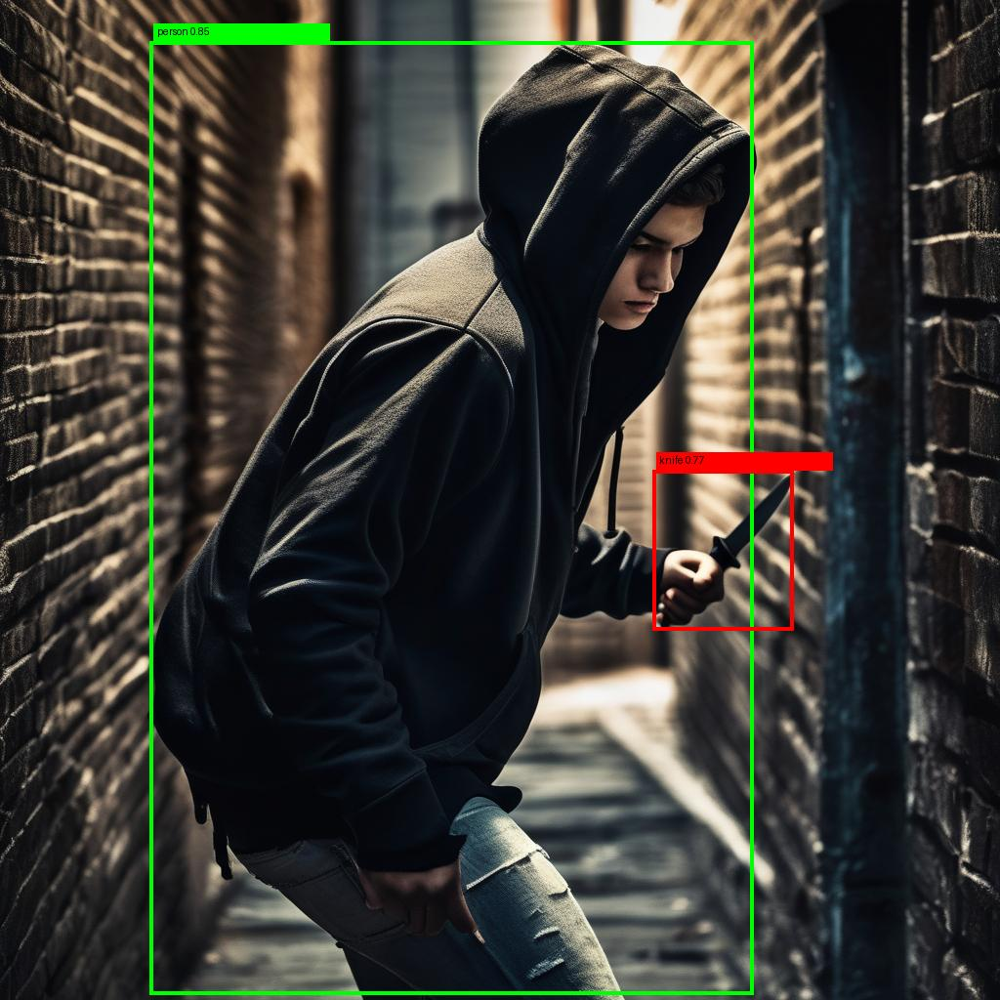

# Generation of Datasets

We aim to generate datsets for knife object detection task. It could be contain caption with slight detailed with person's motion (e.g. a person is holding a knife, a person is swinging a knife, ...). 

## Run 

- setting 

    ```bash
    pip install --upgrade pip
    pip install torch torchvision torchaudio --index-url https://download.pytorch.org/whl/cu118
    pip install diffusers transformers accelerate safetensors pillow tqdm sentencepiece
    ```

- run 

    ```bash
    python generate_knife_dataset.py \
        --output_dir ./knife_dataset \
        --num_samples 200 \
        --device cuda \
        --box_threshold 0.40 \
        --text_threshold 0.35 \
        --width 1024 \
        --height 1024 \
        --steps 30 \
        --guidance_scale 7.5 \
        --val_ratio 0.2 \
        --save_visualizations \
        --max_visualizations_per_split 30
    ```

- Expected Output: 

        knife_dataset/
            images/
                train/
                val/
            labels/
                train/
                val/
            annotations/
                train/
                val/
            meta/
                train/
                val/
            visualizations/
                train/
                val/
            anncsv/
                annotation.csv
                annotation_train.csv
                annotation_val.csv
            failed/
            logs/
            dataset.yaml

- Expected `dataset.yaml`: 

        path: /abs/path/to/knife_dataset_v2
        train: images/train
        val: images/val
        names:
            0: person
            1: knife

- Expected `annotation.csv`: 

        label_name,bbox_x,bbox_y,bbox_width,bbox_height,image_name,image_width,image_height,split,caption,category
        knife,312,145,84,210,image_000001.jpg,1024,1024,train,"A man is holding a knife in a kitchen",dangerous
        person,201,88,502,810,image_000001.jpg,1024,1024,train,"A man is holding a knife in a kitchen",dangerous

## Description 

### Caption Text Design 

- Basic template 

    A person is {action} a knife in {environment}

- Action category 
    
    - Danget Actions: 
        - holding a knife
        - swinging a knife
        - pointing a knife at someone
        - attacking with a knife
        - threatening with a knife
        - chasing someone with a knife

    - Neutral Actions: 
        - cutting food with a knife
        - cooking with a knife
        - preparing ingredients with a knife

    - Hard cases: 
        - hiding a knife behind back
        - concealing a knife in pocket
        - partially visible knife

    - Environment Diversity: 
        - street
        - kitchen
        - restaurant
        - dark alley
        - indoor room
        - subway station
        - parking lot
        - office

    - Person variation
        - man / woman / teenager
        - wearing hoodie / suit / casual
        - face visible / occluded

- Examples: 

    - A man is holding a knife in a kitchen
    - A person is swinging a knife in a dark alley
    - A woman is cutting vegetables with a knife in a restaurant
    - A person is hiding a knife behind their back in a street
    - A man is threatening someone with a knife in a parking lot


    <div align="center">
    <table>
        <tr>
        <td></td>
        <td></td>
        <td></td>
        </tr>
        <tr>
        <td></td>
        <td></td>
        <td></td>
        </tr>
    </table>
    </div>


### Image Generation Strategy (SDXL)

- Main goal: to train detection model → exact location + variety situations 

- Prompt: A realistic photo of {person description} {action} a knife in {environment}, full body, natural lighting, high detail. 
- Negative Prompt: blurry, low quality, cartoon, unrealistic, extra limbs, distorted hands. 

- Optioins: 
    - camera diversity
        - close-up
        - medium shot
        - long shot
        - side view
        - top-down

    - light diversity
        - daylight
        - night
        - low light
        - backlight

    - occlusion
        - knife partially hidden
        - hand covering knife

### Detection Annotation Generation 

- SDXL doesn't give the bbox. 

- There are 3 possible ways to gain bboxes: 

    - 1. SAM + CLIP 
    - 2. GroundingDINO 
    - 3. synthetic annotation 

### Dataset Structure 

- YOLO format 

        image_001.jpg
        image_001.txt

    txt:
        
        class_id x_center y_center width height

- JSON format 

    ```json
    {
        "image": "image_001.jpg",
        "objects": [
            {
            "label": "knife",
            "bbox": [x, y, w, h]
            }
        ],
        "caption": "A person is holding a knife in a kitchen"
    }
    ```

### Considering Data Distribution 

- make it balanced 

    | Category  | 비율  |
    | --------- | --- |
    | dangerous | 40% |
    | neutral   | 40% |
    | hidden    | 20% |

- include hard cases

    - small knife
    - motion blur
    - low light
    - multiple people
    - cluttered background

### Overall Pipeline 

1. prompt gengeration (action + environment)
2. SDXL image generation 
3. Grounding DINO → knife detection
4. bbox saving 
5. caption saving 

