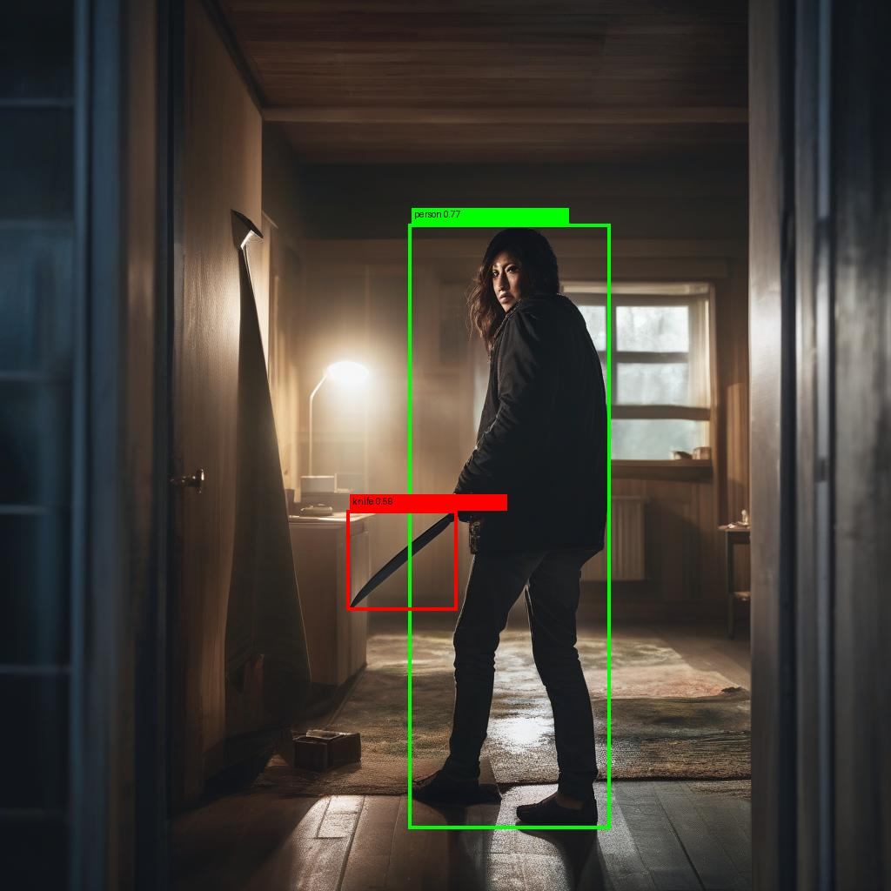
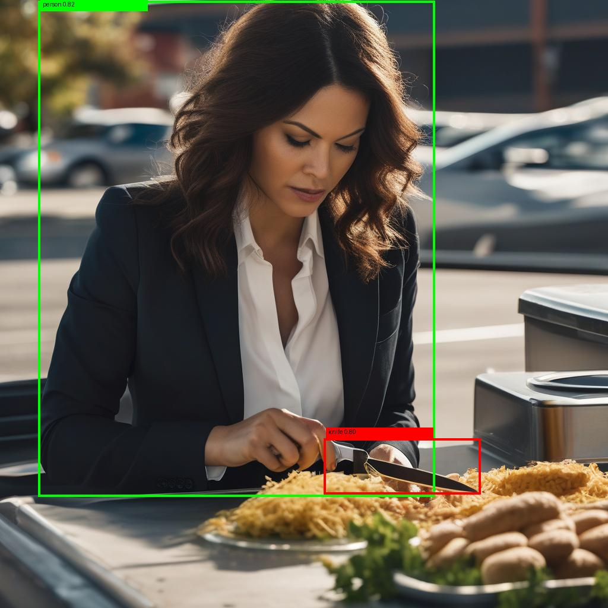
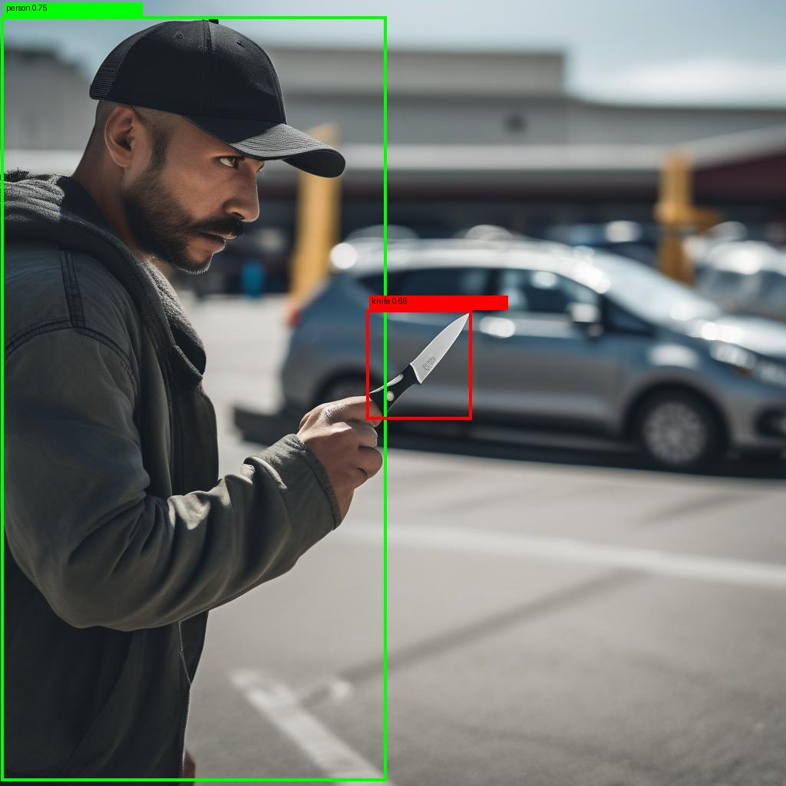
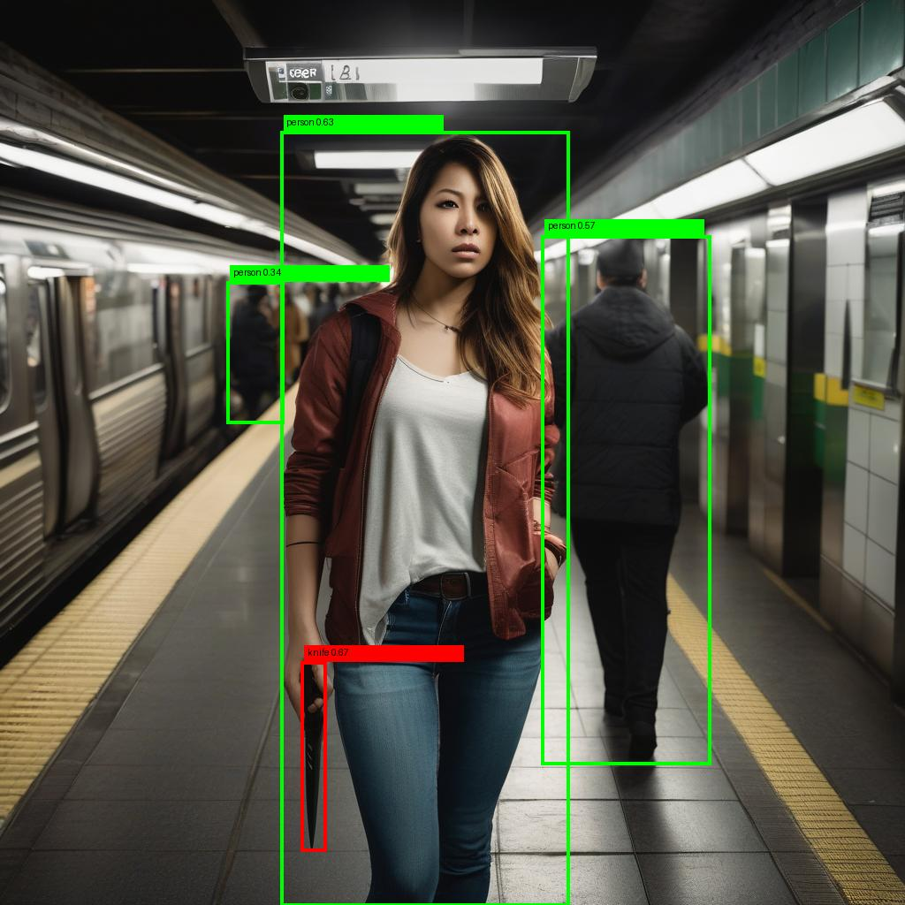

# Net Challenge Project - **Dataset Process** 

## GroundingDINO Finetuning Dataset Processing/Preparing  

This repository contains the **code used to build the custom dataset for fine-tuning the GroundingDINO model**. 

The main code for this project is located in the [GroundingDINO Finetune](https://github.com/gyoenge/net-challenge-groundingdino-finetune) repository, based on [Original GroundingDINO Finetune Pipeline Opensource](https://github.com/Asad-Ismail/Grounding-Dino-FineTuning). Please visit it for more details about the project. 

## [Added] Generation of Datasets

We aim to generate datsets for knife object detection task. It could be contain caption with slight detailed with person's motion (e.g. a person is holding a knife, a person is swinging a knife, ...). 

See the detailed information in `./gen_datasets/` and inside `README.md` file. 

- Example data: 

    <div align="center">
    <table>
        <tr>
        <td></td>
        <td></td>
        <td></td>
        </tr>
        <tr>
        <td></td>
        <td></td>
        <td></td>
        </tr>
    </table>
    </div>

## Converting formats of Datasets 

To run the format converting, you have to move on `./convert_formats/` directory, and follow the below running guide. 

- hand labeling to annotation.csv :  
    1. prepare folders : 
        - images/
        - annotation/ 
    2. run 
        ```bash 
        cd ./convert_formats/
        python handlabeling_to_anncsv.py
        ```

- yolov8 labeling(txt) to annotation.csv : 
    1. prepare folders : 
        - raw_data/images/ 
        - raw_data/labels/
        - processed_annotation/
    2. run 
        ```bash 
        cd ./convert_formats/
        python yolotxt_to_anncsv.py 
        ```

- custom dataset (video, json) to annotation.csv
    (here we used aihub smoking person dataset)
    1. prepare folders : 
        - raw_data/video/
        - raw_data/label/
        - processed_data/images/
        - processed_data/annotation/
    2. run 
        ```bash 
        cd ./convert_formats/
        python aihub_to_anncsv.py 
        ```

- custom dataset (video, json) to yolov8 lageling(txt) : 
    1. prepare folders : 
        - raw_data/video/
        - raw_data/label/
        - processed_data/images/
        - processed_data/label/
    2. run 
        ```bash 
        cd ./convert_formats/
        python aihub_to_yolo/aihub_to_yolov8txt.py
        ```
